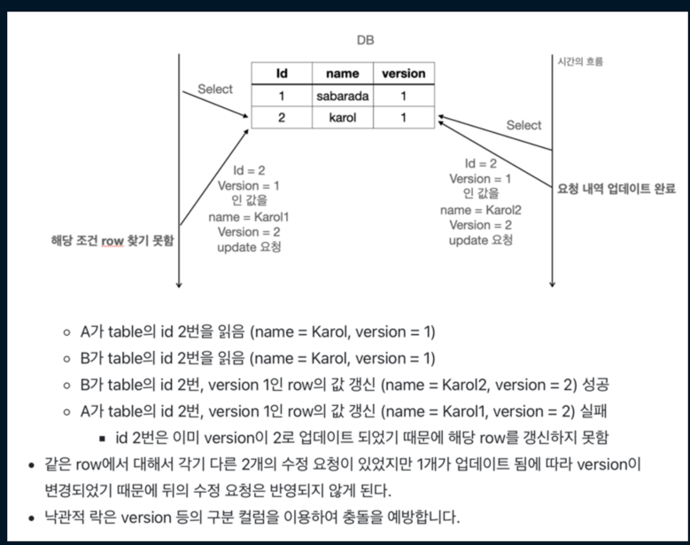

# synchronized
synchronized를 적용했음에도 불구하고, increase와 decrease에는 동시성 문제를 해결하지 못한다. 

원인은 @Transactional 에 있다. 

해당 에너테이션을 붙이면 스프링에서는 AOP를 이용해 아예 새로운 클래스에서 매서드를 새로 선언하여 구현하기에 
synchronized가 적용되지 않는 것이다. 

만약 재고 개수 변동 메서드에 synchronized를 사용하려면 @Transactional를 지운 후 별도 저장하는 로직을 추가하여 구현해야 할 것이다. 

# pessimistic
기존 findById에 그대로 PESSIMISTIC_WRITE 락을 적용했더니, read_only translation에서는 적용이 안된다는 에러가 발생했다. 
할 수 없이 별도 메서드를 정의해서 구현했다.
 

비관적 락은 데이터에 접근하기 전에 락을 걸어 다른 트랜젝션이 접근을 차단하는 방식입니다. 
즉 트랜젝션 시작 시 shared lock(공유 잠금, 읽기 잠금) 또는 exclusive lock(배타적 잠금, 쓰기 잠금) 을 걸고 시작하는 방법입니다. 

데이터의 무결성이 중요하고, 충돌이 많이 발생하여 잦은 롤백으로 인한 효율성 문제가 예상되는 곳에 효율적입니다. 

# optimistic lock
구현 시에 service 레벨에서 @Transactional을 적용하면 commit이 안되는 문제가 발생했다. 왜 그런 것일까?? 

낙관적 락은 충돌이 거의 발생하지 않을 것이라 가정하고, 충돌이 발생한 경우에 대비하는 방식이다. 
데이터를 읽을 때는 락을 걸지 않고, 데이터 업데이트 시 충돌 여부를 확인한다. 
version을 통해서 확인하는데, 따라서 entity 에 version에 관한 field가 있어야 한다. 
락을 취득하지 않기에 deadlock이 발생할 가능성이 낮으나, 
충돌 발생 시 롤백 처리 등 충동 상황에 대한 적절한 처리가 필요하다. 
데이터 충돌 가능성이 낮거나 성능이 중요한 경우에 사용하게 된다. 

# Named Lock
처음에는 기존에 optimized lock와 동일하게 callback으로 진행하려 했으나, 트랜젝션 전파수준이 달라서 실패  
결국 proxy 패턴으로 구현하였다.  

Named Lock은 고유한 이름으로 식별되는 잠금 
row나 table 단위로 락을 거는 passimistic lock과 달리, named lock은 metadata 단위로 락을 적용한다. 
mysql 레벨에서 지원 (native query) 즉, 추가 SW나 라이브러리가 필요 없고, mysql 서버 메모리에서 동작하기에 빠르나, 
user 측에서 락을 직접 관리해야한다는 부담이 있다. 
 
GET_LOCK 과 RELEASE_LOCK 을 통해 락을 잠금 및 해제한다. 
named lock 사용 시 propergation을 별도로 설정해주어야 하는데,  
부모의 트랜젝션과 동일한 범위로 묶인다면 DB에 commit 되기 전에 락이 풀리는 상황이 발생할 수 있다.  
따라서 메인 로직에는 REQUIRED_NEW를 설정하여 별도 트랜젝션으로 분리하는 것이 중요하다.  

# MVCC

mysql 의 default 격리 수준은 repeatable read임. 즉, MVCC 지원. 

즉, 영속성 컨텍스트 안쓰고 깡쿼리 찔러도 동시성 대응 가능 

단, 도메인 로직과 상이해질 수 있음. 위 코드에서는 재고가 0 미만으로 변경될 수 있음. 
즉 jpql 사용 시 도메인 레벨에서 값 검증 로직이 있다면 확인해봐야 함. 