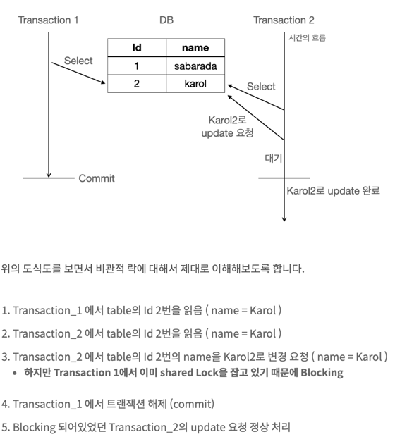

# pessimistic
기존 findById에 그대로 PESSIMISTIC_WRITE 락을 적용했더니, read_only translation에서는 적용이 안된다는 에러가 발생했다.
할 수 없이 별도 메서드를 정의해서 구현했다.
 

비관적 락은 데이터에 접근하기 전에 락을 걸어 다른 트랜젝션이 접근을 차단하는 방식입니다.
즉 트랜젝션 시작 시 shared lock(공유 잠금, 읽기 잠금) 또는 exclusive lock(배타적 잠금, 쓰기 잠금) 을 걸고 시작하는 방법입니다.

데이터의 무결성이 중요하고, 충돌이 많이 발생하여 잦은 롤백으로 인한 효율성 문제가 예상되는 곳에 효율적입니다.