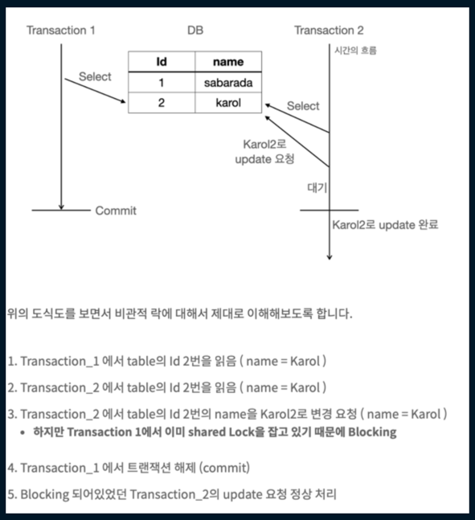

# optimistic lock
구현 시에 service 레벨에서 @Transactional을 적용하면 commit이 안되는 문제가 발생했다. 왜 그런 것일까??

낙관적 락은 충돌이 거의 발생하지 않을 것이라 가정하고, 충돌이 발생한 경우에 대비하는 방식이다.
데이터를 읽을 때는 락을 걸지 않고, 데이터 업데이트 시 충돌 여부를 확인한다.
version을 통해서 확인하는데, 따라서 entity 에 version에 관한 field가 있어야 한다.
락을 취득하지 않기에 deadlock이 발생할 가능성이 낮으나,
충돌 발생 시 롤백 처리 등 충동 상황에 대한 적절한 처리가 필요하다.
데이터 충돌 가능성이 낮거나 성능이 중요한 경우에 사용하게 된다.
